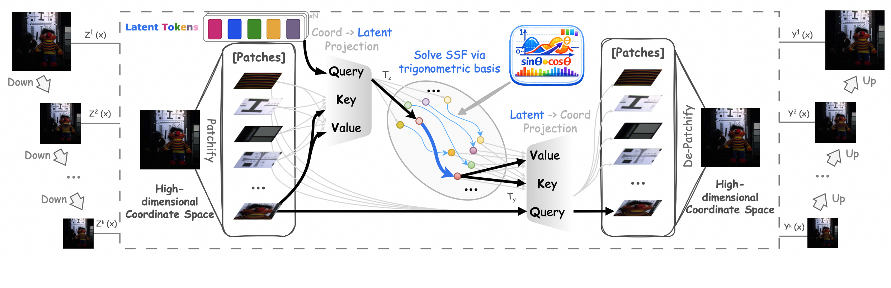

I am a Ph.D. student in the College of Computer Science at Zhejiang University of Technology, working with Prof. [Chunhua Shen (沈春华)](https://scholar.google.com/citations?user=Ljk2BvIAAAAJ&hl=en)'s team under the supervision of Prof. [Jianwei Zheng (郑建炜)](https://scholar.google.com/citations?hl=en&user=X0wntOEAAAAJ). I expect to graduate in June 2028.

<strong style="color: red;">I am currently seeking long-term internship opportunities through graduation, with a focus on multimodal large models.</strong>

# 📝 Publications

  

    

      
ICML 2026

      
    

  

  

[**Solving Spatial-Spectral Fusion with Latent Spectral Operators**](https://weili419.github.io/latent-spectral-operators/)

**Wei Li**, Jieyuan Pei, Junnan Xu, Xuanfeng Ding, Junwei Zhu, Wanjun Chen, Jianwei Zheng

[Project](https://weili419.github.io/latent-spectral-operators/) / [Code](https://github.com/weili419/LSO) / [Dataset](https://www.modelscope.cn/datasets/WeiLi419/Latent_Spectral_Operators_Cave_and_Harvard)

  

# Honors and Awards

- 2025年中国科协青年人才托举工程博士生专项计划
- 2025年博士国家奖学金
- 2025年浙江工业大学学术之星

# Educations

- 2019.09 - 2023.06, Undergraduate, Zhejiang University of Technology, Computer Science and Technology + Intelligent Science and Technology, double major; CPC member.
- 2023.09 - 2025.06, M.S., Zhejiang University of Technology, Computer Science and Technology (081200); GPA and comprehensive evaluation ranked in the top 1%.
- 2025.09 - Present, Ph.D., Zhejiang University of Technology, Computer Science and Technology (081200).

# Internships

## 2026.03.09 - Present, 阿里巴巴虎鲸文娱, 视频渲染去噪

- 蒙特卡洛采样渲染成像会产生长尾分布噪声，从成像角度出发，利用成像时的统计量解决视频渲染时出现的噪声及伪影。预计投稿 AAAI。

## 2025.08.04 - 2026.02.04, 同花顺AIGC算法部门, 图像编辑 & 理解与生成编辑统一模型

- FreeEraser: Mask-Free Object Removal via Attention Regularization. (ECCV 在审，初始分数 442)
- 利用 NanoBanana 构建数据集，LoRA 微调 Flux-Kontext 模型用于图像擦除。图像编辑
- LongCat, Qwen-image, Qwen-vl, Flux-Kontext, Flux-fill, 理解与生成统一模型
